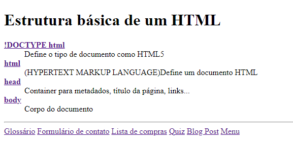
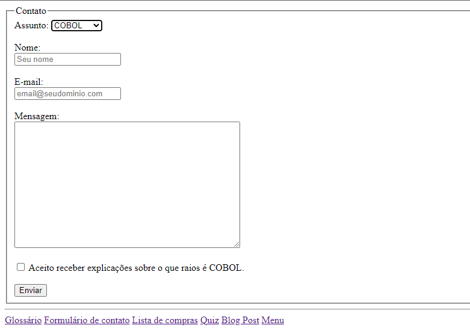
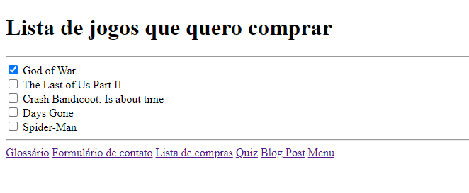
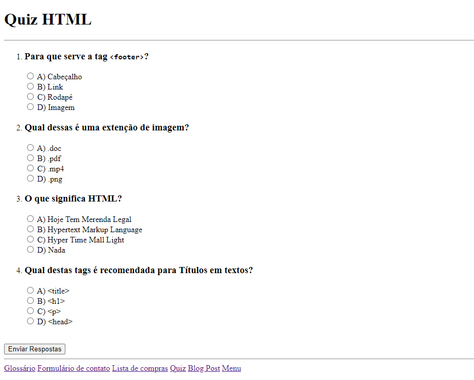
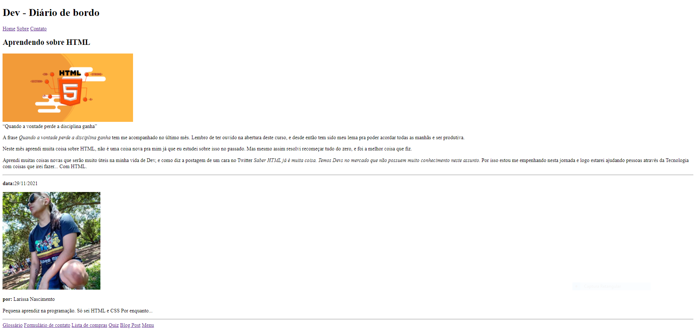
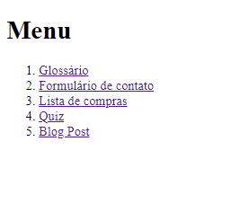

# 📕 Desafios HTML | Discover
- Nesta série de desafios, praticamos nossas habilidades com HTML, utilizando as tags mais comuns no dia a dia do desenvolvimento web.

## 1 - Glossário
- Criamos um glossário com a tag `<dl>` para fazer uma lista de descrição.
  

## 2 - Formulário de contato
- Fizemos um formulário utilizando as tags `<form>` e `<fieldset>`.

## 3 - Lista de compras
- Desenvolvemos uma lista de compras para praticarmos as tags `<li>` para lista e `input type="checkbox"` para as marcações.

## 4 - Quiz
- Foi feito um quiz sobre um tema de nossa escolha, exercitando as propriedades de `input` e a tag `<li>`.

## 5 - Blog Post
- Talvez o mais complexo de todos os desafios, foi proposto que fizessemos uma página de um blog com Título, parágrafos e imagens.

## 💡 Extra
- Adicionei uma página index.html com um menu que possui acesso a todos as páginas do desafio, e cada página possui um menu de navegação.

